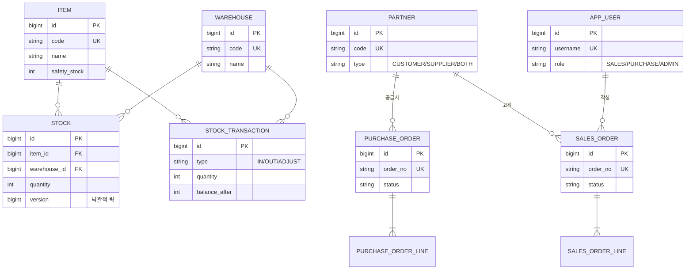
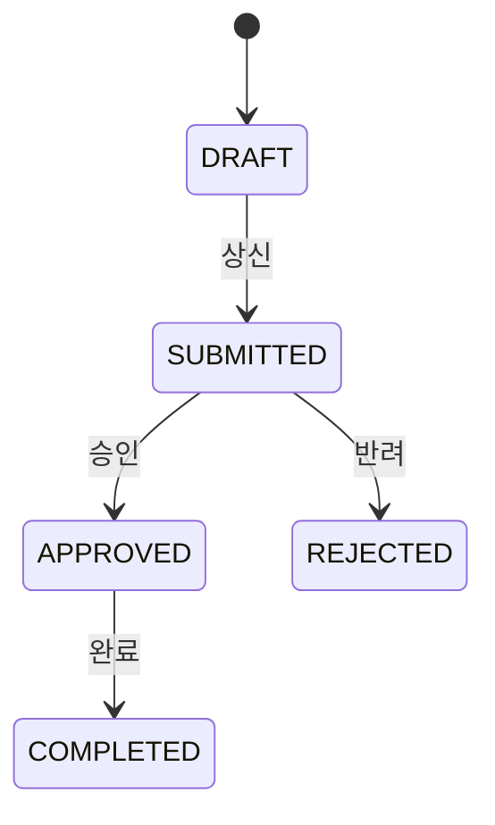
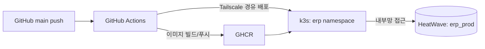

# ERP: 재고·주문 관리 시스템

재고 수불, 발주·수주, 결재 워크플로우, 권한 관리를 다루는 백엔드 중심의 미니 ERP입니다. 단순 CRUD를 넘어 재고 동시성 제어, 상태 머신 기반 결재, 트랜잭션 정합성, JWT 인증·인가 같은 실무 난제를 직접 구현하고 부하 테스트로 검증했습니다.

- 개발 형태: 1인 개발 (개인 프로젝트)
- 성격: 도소매 유통을 가정한 재고·주문 중심 ERP

---

## 기술 스택

| 구분 | 내용 |
| --- | --- |
| Language | Java 17 |
| Framework | Spring Boot 4.1.0, Spring Data JPA, Spring Security, Spring Validation |
| Database | MySQL (InnoDB), Hibernate ORM |
| 인증 | JWT (jjwt), BCrypt |
| 동시성 | JPA 낙관적 락(@Version) + spring-retry, 비관적 락(@Lock) |
| Build | Gradle |
| 배포 | Docker, GitHub Actions, k3s (쿠버네티스), GHCR |
| 인프라 | OCI MySQL HeatWave, Tailscale, NetworkPolicy |

---

## 도메인 모델

기능(도메인)별로 패키지를 분리했습니다. 마스터 데이터(품목·창고·거래처), 재고(잔고·수불이력), 주문(발주·수주), 사용자·권한으로 구성됩니다.

재고는 현재 잔고(`STOCK`)와 입출고 원장(`STOCK_TRANSACTION`)을 분리했습니다. 잔고는 조회를 빠르게 하고, 원장은 수불 추적과 정합성 검증에 씁니다. 원장의 `balance_after`에 거래 직후 잔고를 남겨, 잔고가 의심스러울 때 이력을 되짚어 검증할 수 있습니다.

---

## 핵심 기능

### 1. 재고 동시성 제어

**문제.** 같은 재고에 출고 요청이 동시에 몰리면 여러 요청이 같은 재고 수량을 읽고 각자 차감해, 재고가 음수가 되는 초과 판매(race condition)가 발생합니다. 엔티티 단의 재고 검사만으로는 막을 수 없습니다. 모든 요청이 검사 시점에는 재고가 충분하기 때문입니다.

**해결.** 두 가지 방식을 각각 구현했습니다.

- 낙관적 락: `STOCK`에 `@Version`을 두어, 저장 시점에 버전이 바뀌었으면 충돌로 실패시킵니다. 여기에 `@Retryable`을 붙여 충돌 시 재고를 다시 읽고 재시도합니다. 재고 부족(비즈니스 예외)은 재시도하지 않고 버전 충돌만 재시도하도록 구분했습니다.
- 비관적 락: `@Lock(PESSIMISTIC_WRITE)`로 조회 시점에 재고 행을 잠급니다(`SELECT ... FOR UPDATE`). 충돌 자체가 발생하지 않아 재시도 로직이 필요 없습니다.

**검증.** 재고 10개에 1개씩 출고하는 요청을 동시에 20건 발생시켰습니다.

| 방식 | 성공 | 최종 재고 | 초과 판매 | 특징 |
| --- | --- | --- | --- | --- |
| 낙관적 락 + 재시도 | 10건 | 0 | 0건 | 충돌·재시도로 version이 판매량보다 더 증가 |
| 비관적 락 | 10건 | 0 | 0건 | 순차 처리로 version이 판매량만큼만 증가 |

두 방식 모두 초과 판매 0건과 재고 정합성을 지켰습니다. 재고처럼 경쟁이 잦은 도메인에서는 재시도 비용이 없는 비관적 락이 더 적합하다고 판단했습니다.

### 2. 발주 결재 워크플로우

**문제.** 발주서는 정해진 순서로만 상태가 바뀌어야 합니다. 작성 중인 발주를 승인 없이 완료하거나, 이미 반려된 발주를 다시 승인하는 등 규칙에 어긋난 상태 변경을 막아야 합니다.

**해결.** 상태 전이 규칙을 엔티티 메서드(`submit`, `approve`, `reject`, `complete`) 안에 넣어, 허용되지 않은 전이는 엔티티가 스스로 예외를 던지도록 했습니다. 상태를 임의로 바꾸는 setter를 열어두지 않고, 의미 있는 동작으로만 전이하게 통제합니다.

**검증.** 정상 흐름(작성 → 상신 → 승인)은 순서대로 전이되고, 승인 상태에서 다시 상신을 시도하면 409 Conflict로 거부됩니다.

### 3. 수주-재고 트랜잭션 정합성

**문제.** 수주를 확정하면 재고가 실제로 빠져야 합니다. 이때 수주 상태 변경, 재고 차감, 수불 이력 기록이 하나라도 어긋나면 "재고는 없는데 주문만 확정된" 상태가 생깁니다.

**해결.** 수주 확정 로직을 하나의 트랜잭션으로 묶고, 재고 차감에는 비관적 락 출고를 재사용했습니다. 어느 품목이든 재고가 부족하면 확정 전체가 롤백됩니다.

**검증.** 재고 70개 상황에서 100개 수주 확정을 시도하면 400 Bad Request로 거부되고, 재고는 70개 그대로, 수주는 `DRAFT`로 유지됩니다. 부분 반영 없이 전부 성공 또는 전부 실패를 보장합니다.

### 4. 인증·인가 (JWT + RBAC)

**문제.** 역할에 따라 접근을 나눠야 합니다. 영업은 수주, 구매는 발주, 발주 승인은 관리자만 가능해야 합니다.

**해결.** BCrypt로 비밀번호를 단방향 암호화해 저장하고, 로그인 시 역할 정보를 담은 JWT(HS384 서명)를 발급합니다. 요청마다 필터에서 토큰을 검증해 인증을 세우고, Spring Security로 경로·역할 기반 접근 제어를 겁니다. 세션 없이 토큰으로만 인증하는 STATELESS 구조입니다.

| 자원 | 접근 가능 역할 |
| --- | --- |
| 발주 승인·반려 | ADMIN |
| 발주 | PURCHASE, ADMIN |
| 수주 | SALES, ADMIN |
| 그 외 | 인증된 사용자 |

**검증.** 토큰 없이 접근하면 403, 관리자 토큰으로는 정상 응답, 영업 토큰으로 발주에 접근하면 403으로 거부됩니다. 로그인은 성공(인증)했지만 권한이 없어(인가) 막히는 것을 확인했습니다.

### 5. 전역 예외 처리

`@RestControllerAdvice`로 도메인 예외를 일관된 HTTP 응답으로 표준화했습니다. 잘못된 요청·비즈니스 위반은 400, 상태 전이 충돌은 409로 내려주고, 검증 실패 시 필드 메시지를 반환합니다. 스택 트레이스는 노출하지 않습니다. 중첩 리스트 요청에도 검증이 적용되도록 구성했습니다.

---

## API 요약

| 메서드 | 경로 | 설명 |
| --- | --- | --- |
| POST | `/api/auth/signup` | 회원가입 |
| POST | `/api/auth/login` | 로그인 (JWT 발급) |
| POST/GET | `/api/items` | 품목 등록·조회 |
| POST/GET | `/api/warehouses` | 창고 등록·조회 |
| POST | `/api/inventory/inbound` | 입고 |
| POST | `/api/inventory/outbound` | 출고 (낙관적 락) |
| POST | `/api/inventory/outbound-pessimistic` | 출고 (비관적 락) |
| POST | `/api/purchase-orders` | 발주 생성 |
| POST | `/api/purchase-orders/{id}/submit` | 상신 |
| POST | `/api/purchase-orders/{id}/approve` | 승인 (ADMIN) |
| POST | `/api/purchase-orders/{id}/reject` | 반려 (ADMIN) |
| POST | `/api/sales-orders` | 수주 생성 |
| POST | `/api/sales-orders/{id}/confirm` | 수주 확정 (재고 출고) |

---

## 배포 및 운영

직접 구축해 운영 중인 k3s 멀티노드 클러스터에 배포했습니다. 외부에 공개된 다른 서비스들과 달리, 사내 시스템을 가정해 외부 노출 없이 내부망에서만 접근하도록 격리한 것이 특징입니다.

배포 파이프라인은 GitHub Actions로 자동화했습니다. main 브랜치에 push하면 JAR을 빌드해 Docker 이미지로 만들고, GHCR에 올린 뒤, Tailscale로 클러스터에 접속해 배포 이미지를 교체합니다.

운영 구성에서 신경 쓴 점은 다음과 같습니다.

- 내부 전용 노출: 서비스를 `ClusterIP`로 두어 외부에 노출하지 않고, 클러스터 접근도 Tailscale 내부망으로 제한했습니다. 도메인과 공개 인그레스를 붙인 외부 공개 서비스와 대비되는 구성입니다.
- 네트워크 격리: `NetworkPolicy`(default-deny)로 `erp` namespace 바깥에서 오는 접근을 차단해, 같은 클러스터의 다른 서비스와 논리적으로 분리했습니다.
- 운영 DB 분리: 로컬 개발 DB와 별개로, OCI MySQL HeatWave에 `erp_prod` 스키마를 두어 운영 데이터를 분리했습니다. 접속 정보와 비밀번호는 코드에 두지 않고 쿠버네티스 Secret으로 주입합니다.
- 노드 지정과 리소스 관리: `nodeSelector`로 지정 노드에 배치하고, requests/limits로 자원 상한을 두었습니다. startup/liveness/readiness 프로브로 기동과 상태를 관리합니다.
